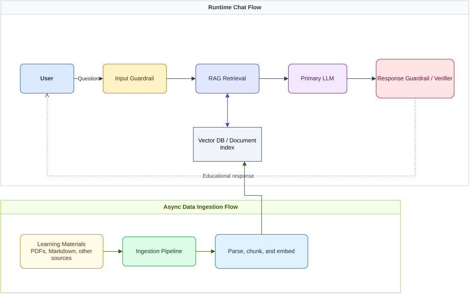

# Architecture

CapiLearn has three main runtime surfaces:

- A React/Vite frontend in `frontend/`
- A FastAPI backend in `backend/`
- A PostgreSQL database with pgvector, started locally through `compose.yaml`

The backend owns authentication bootstrap, chat and conversation APIs, RAG retrieval, LLM orchestration, guardrails, usage/admin reporting, instructor dashboards, student activity, and Clerk webhooks.

## Runtime Flow

1. The browser client signs users in with Clerk.
2. The frontend calls the FastAPI backend through `VITE_API_BASE_URL`.
3. The backend validates Clerk identity or test-mode auth claims.
4. Chat requests pass through policy guardrails and RAG retrieval.
5. The LLM layer calls the configured LiteLLM provider.
6. Conversations, usage data, activity data, RAG documents, chunks, and embeddings are stored in PostgreSQL.

## Backend Areas

| Area | Path | Responsibility |
| --- | --- | --- |
| Chat | `backend/chat/` | Conversations, messages, citations, and chat request flow |
| LLM | `backend/llm/` | Provider calls, prompts, guardrails, costing, and trace events |
| RAG | `backend/rag/` | Retrieval, embeddings, citations, chunking, and pgvector access |
| Ingestion | `backend/ingestion/` | Manual corpus ingestion into pgvector |
| Auth | `backend/auth/` | Clerk identity, profile projection, demo admin sign-in token |
| Admin | `backend/admin/` | Admin health and usage dashboard APIs |
| Instructor | `backend/instructor/` | Instructor dashboard APIs |
| Activity | `backend/activity/` | Student activity calendar and login tracking |
| Webhooks | `backend/webhooks/` | Clerk webhook handling |
| Core | `backend/core/` | Settings, database, exceptions, rate limiting, and observability |

## API Shape

All application routers are mounted under the backend `api_prefix`, which defaults to `/api`.

Current route groups include:

- `/api/me`
- `/api/auth/demo-admin/sign-in-token`
- `/api/conversations`
- `/api/activity`
- `/api/admin`
- `/api/instructor`
- `/api/webhooks`
- `/health`

FastAPI docs are disabled unless `API_DOCS_ENABLED=true`.

## Data and Migrations

Alembic migrations live in `alembic/versions/`. The current migration head is `20260624_0016`.

Local PostgreSQL uses `pgvector/pgvector:0.8.2-pg18-trixie`, with the vector extension initialized from `docker/postgres/init`.

## RAG Documentation

RAG has more detailed backend-owned documentation:

- [RAG architecture](../../backend/docs/rag/architecture.md)
- [RAG runbook](../../backend/docs/rag/runbook.md)
- [RAG metrics](../../backend/docs/rag/metrics.md)
- [RAG engineering notes](../../backend/docs/rag/engineering-notes.md)

## Diagram

